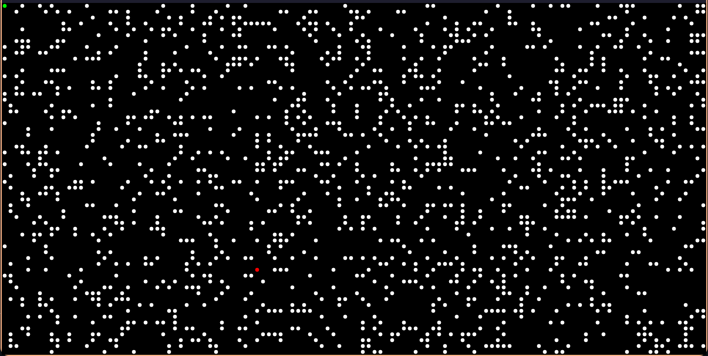
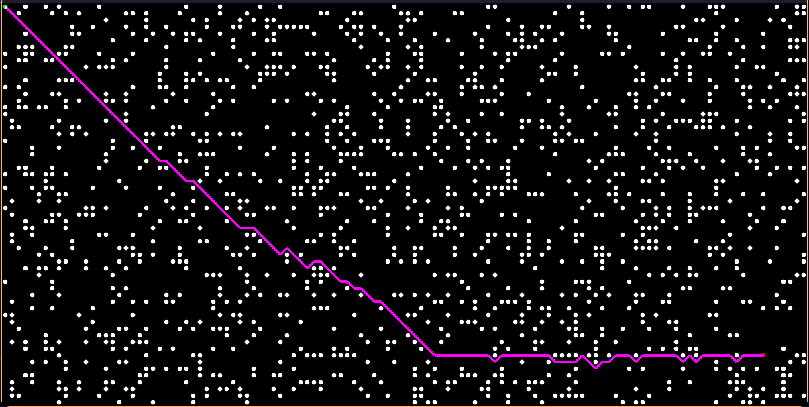
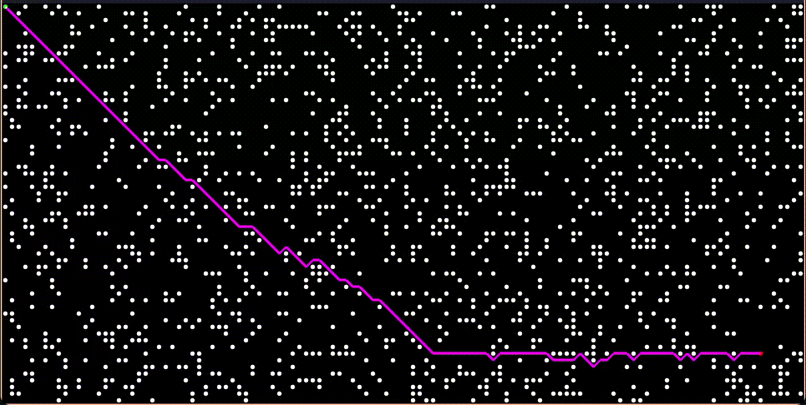

# A* Algorithm Visualizer in Go

🚀 A lightweight A* pathfinding algorithm visualizer built in Go! This project demonstrates how the A* algorithm efficiently finds the shortest path between two points in a grid-based environment.

## 🔥 Features
- **Fast A* pathfinding** with clear step-by-step visualization.
- **Lightweight and efficient**, implemented in pure Go.
- **Customizable grid**, allowing different obstacle placements.
- **Modular design**, making it easy to extend and improve.

## 📂 Project Structure
```
.
├── const.go       # Constants for the visualizer
├── ds/            # Data structures for pathfinding
│   └── idxMap.go  # Index mapping utilities
├── game/          # Core game logic and grid management
│   ├── grid.go    # Grid representation
│   └── spot.go    # Spot struct for nodes
├── go.mod         # Go module file
├── go.sum         # Dependency lock file
└── main.go        # Entry point for the application
```

## ⚡ Installation & Usage
1. Clone this repository:
   ```sh
   git clone https://github.com/Arjun259194/A-Start-Go.git
   cd A-Start-Go
   ```
2. Run the project:
   ```sh
   go run main.go
   ```
3. Modify `grid.go` to experiment with different grid sizes and obstacles.

## 🛠️ How It Works
The A* algorithm uses a combination of the following:
- **G-cost**: Distance from the start node.
- **H-cost**: Estimated distance to the target (heuristic).
- **F-cost**: Sum of G and H, guiding the best path.

The algorithm efficiently finds the shortest route by prioritizing nodes with the lowest F-cost. For how to interact [click](/Use.md)

## 📸 Preview 



